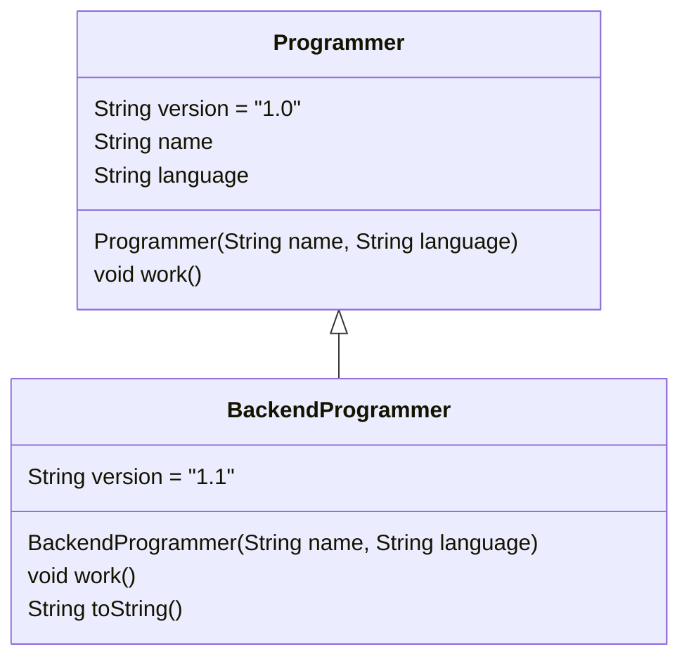

# Solution01

`src/Solution01.java`는 상속, 오버라이딩, `super`, 필드 숨김(field hiding), 동적 바인딩을 한 번에 보여주는 예제다.

## 1. 한눈에 보기

| 항목 | 내용 |
|---|---|
| 부모 클래스 | `Programmer` |
| 자식 클래스 | `BackendProgrammer extends Programmer` |
| 핵심 메서드 | `work()`, `toString()` |
| 핵심 필드 | `version`, `name`, `language` |
| 핵심 개념 | 상속, 오버라이딩, `super(...)`, `this`, 정적 바인딩, 동적 바인딩 |

## 2. 클래스 구조



## 3. 실행 흐름

```mermaid
flowchart TD
    A[main 시작] --> B[new Programmer(\"John\", \"Java\")]
    B --> C[programmer.work()]
    C --> D[Programmer.work 출력]
    D --> E[programmer.version 출력]
    E --> F[programmer.toString() 출력]
    F --> G[new BackendProgrammer(\"Jane\", \"Python\")]
    G --> H[bp.work()]
    H --> I[BackendProgrammer.work 출력]
    I --> J[bp.version 출력]
    J --> K[bp.toString() 출력]
    K --> L[new BackendProgrammer(\"John\", \"Java\") as Programmer]
    L --> M[programmer2.version]
    M --> N[programmer2.toString()]
```

## 4. 초심자용 설명

### 상속

`BackendProgrammer`는 `Programmer`를 물려받는다.
즉, `name`, `language`, `work()` 같은 공통 기능을 재사용할 수 있다.

### 생성자와 `super(...)`

자식 클래스 생성자는 먼저 부모 생성자를 불러야 한다.

| 코드 | 의미 |
|---|---|
| `BackendProgrammer(String name, String language) { super(name, language); }` | 부모 필드를 먼저 초기화 |
| `this.name = name;` | 현재 객체의 필드에 값 저장 |

`super(name, language)`는 부모의 생성자 호출이다.  
이 예제에서는 부모가 기본 생성자를 따로 제공하지 않으므로, 반드시 인자를 넘겨야 한다.

### 오버라이딩

`BackendProgrammer`는 `work()`를 다시 정의한다.

| 항목 | 설명 |
|---|---|
| 부모 메서드 | `Programmer.work()` |
| 자식 메서드 | `BackendProgrammer.work()` |
| 결과 | 같은 이름의 메서드가 자식 쪽 구현으로 바뀜 |

즉, `bp.work()`를 호출하면 자식 클래스의 메서드가 실행된다.

### `toString()` 오버라이딩

`System.out.println(programmer)` 같은 출력은 내부적으로 `toString()`을 사용한다.

| 타입 | 출력 동작 |
|---|---|
| 기본 `Object.toString()` | 클래스명 + 해시코드 형태 |
| 오버라이드된 `toString()` | 사람이 읽기 쉬운 문자열 |

그래서 `BackendProgrammer`는 `name`, `language`를 보기 좋게 출력한다.

### 필드 숨김

`version`은 부모와 자식에 모두 있다.

| 표현식 | 기준 | 결과 |
|---|---|---|
| `programmer.version` | 참조 변수 타입 `Programmer` | `"1.0"` |
| `bp.version` | 참조 변수 타입 `BackendProgrammer` | `"1.1"` |
| `programmer2.version` | 참조 변수 타입 `Programmer` | `"1.0"` |

메서드와 달리 **필드는 오버라이딩되지 않는다**.  
필드는 참조 변수 타입 기준으로 결정되는 경향이 있다.

## 5. 면접대비용 정리

### 자주 나오는 질문

| 질문 | 핵심 답변 |
|---|---|
| 상속과 오버라이딩의 차이는? | 상속은 기능을 물려받는 것이고, 오버라이딩은 부모 메서드를 자식이 다시 정의하는 것이다. |
| `super(...)`는 왜 필요한가? | 부모 객체 상태를 먼저 초기화하기 위해 필요하다. |
| `programmer2.version`은 왜 `1.0`인가? | `version`은 필드라서 동적 바인딩 대상이 아니고, 참조 타입 기준으로 해석되기 때문이다. |
| `programmer2.toString()`은 왜 자식 결과가 나오나? | `toString()`은 오버라이딩된 메서드라서 실제 객체 타입 기준으로 호출된다. |
| 필드와 메서드의 바인딩 차이는? | 메서드는 일반적으로 동적 바인딩, 필드는 정적 바인딩에 가깝다. |

### 핵심 포인트

| 포인트 | 설명 |
|---|---|
| 메서드 오버라이딩 | 실제 객체 기준으로 동작 |
| 필드 숨김 | 참조 타입 기준으로 보이는 경우가 많음 |
| `super` | 부모 생성자나 부모 구현을 명시적으로 사용 |
| `this` | 현재 객체 자신을 의미 |

## 6. 기억할 문장

> 메서드는 객체가 결정하고, 필드는 참조 타입이 결정하는 경우를 먼저 떠올리면 된다.

