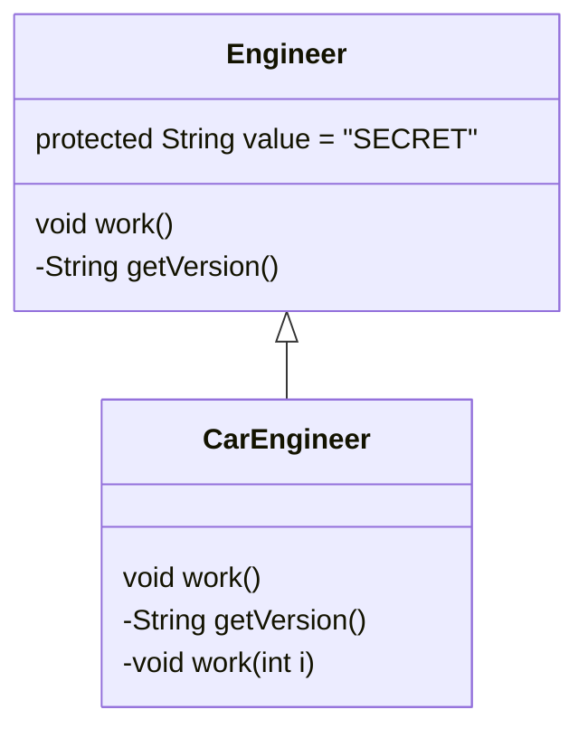
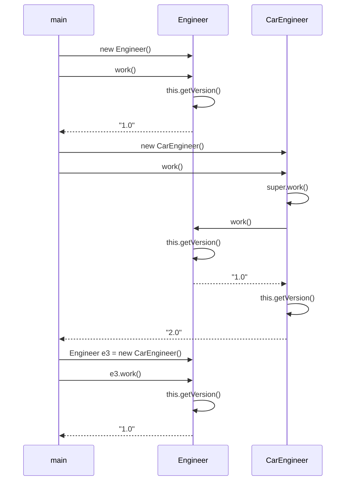

# Solution02

`src/Solution02.java`는 상속 구조 안에서 `private` 메서드, 접근 제어자, 정적/동적 바인딩의 차이를 확인하는 예제다.

## 1. 한눈에 보기

| 항목 | 내용 |
|---|---|
| 부모 클래스 | `Solution02.Engineer` |
| 자식 클래스 | `CarEngineer extends Solution02.Engineer` |
| 핵심 메서드 | `work()`, `getVersion()` |
| 핵심 키워드 | `protected`, `private`, 오버라이딩, `super.work()`, 다형성 |
| 핵심 포인트 | `private`는 오버라이딩되지 않음 |

## 2. 클래스 구조



## 3. 호출 흐름



## 4. 초심자용 설명

### `private` 메서드는 상속되지만 오버라이딩 대상이 아니다

`Engineer`의 `getVersion()`은 `private`이다.
`private` 메서드는 클래스 내부에서만 보이므로, 자식 클래스가 같은 이름의 메서드를 새로 만들어도 부모 메서드를 덮어쓰는 것이 아니다.

| 위치 | 의미 |
|---|---|
| `Engineer.getVersion()` | Engineer 내부 전용 |
| `CarEngineer.getVersion()` | CarEngineer 내부 전용 |
| 두 메서드 관계 | 서로 다른 메서드 |

### `super.work()`

`CarEngineer.work()` 안에서 `super.work()`를 호출하면 부모의 `work()`가 실행된다.

| 코드 | 동작 |
|---|---|
| `super.work()` | 부모 구현 실행 |
| `this.getVersion()` | 현재 객체 기준 메서드 탐색 |

### 그런데 왜 `super.work()` 안에서 `1.0`이 나오나

부모 클래스의 `work()` 내부에 있는 `this.getVersion()`은 부모 클래스의 `private` 메서드를 사용한다.

| 상황 | 실제 동작 |
|---|---|
| `Engineer.work()` 호출 | `Engineer.getVersion()` 사용 |
| `CarEngineer.work()`에서 `super.work()` 호출 | 여전히 `Engineer.work()` 내부 로직 실행 |
| `CarEngineer`의 `getVersion()` | 부모 `work()`에서 대체되지 않음 |

즉, `private`는 오버라이딩의 대상이 아니므로 동적 바인딩이 적용되지 않는다.

### `protected`

`Engineer`의 `value`는 `protected`다.

| 접근 수준 | 의미 |
|---|---|
| `private` | 클래스 내부만 |
| `protected` | 같은 패키지 + 상속 관계에서 접근 가능 |
| `public` | 어디서든 접근 가능 |

이 예제에서는 `value`를 직접 쓰지 않지만, 상속 문법과 접근 제어자 설명용으로 들어 있다.

## 5. 면접대비용 정리

### 자주 나오는 질문

| 질문 | 핵심 답변 |
|---|---|
| `private` 메서드는 오버라이딩 가능한가? | 불가능하다. 자식이 같은 이름을 선언해도 별개의 메서드다. |
| `super.work()`는 무엇을 의미하나? | 부모 클래스의 `work()` 구현을 직접 실행하는 것이다. |
| 왜 `e3.work()`에서 `1.0`이 나오나? | 부모 클래스의 `work()`가 실행되고, 그 안의 `private getVersion()`이 호출되기 때문이다. |
| `CarEngineer.getVersion()`은 왜 안 쓰이나? | 부모의 `work()`는 부모 클래스 내부에서 `private` 메서드를 직접 호출하기 때문이다. |
| `protected`는 언제 쓰나? | 상속 관계에서 자식이 부모 멤버를 활용해야 할 때 쓴다. |

### 바인딩 관점 정리

| 대상 | 바인딩 특징 | 예제 결과 |
|---|---|---|
| `work()` | 오버라이딩 시 동적 바인딩 | 자식의 `work()`가 실행됨 |
| `private getVersion()` | 정적 성격이 강함 | 부모 클래스 내부 메서드만 사용 |
| `e3.work()` | 참조 타입은 `Engineer`, 실제 객체는 `CarEngineer` | 부모 구현 기준으로 시작 |

## 6. 핵심 도식

```mermaid
flowchart LR
    A[Engineer.work()] --> B[this.getVersion()]
    B --> C[Engineer.private getVersion() = 1.0]
    D[CarEngineer.work()] --> E[super.work()]
    E --> A
    D --> F[this.getVersion()]
    F --> G[CarEngineer.private getVersion() = 2.0]
```

## 7. 기억할 문장

> `private`는 상속받는 것처럼 보여도 오버라이딩은 되지 않는다. 같은 이름의 메서드를 자식이 만들어도 부모 내부 호출은 부모 메서드로 고정된다.

