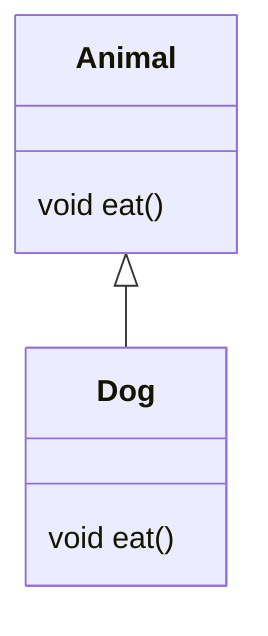

# Solution03

`src/Solution03.java`는 업캐스팅, 다운캐스팅, `instanceof`, 패턴 매칭을 통해 상속형 다형성을 설명하는 예제다.

## 1. 한눈에 보기

| 항목 | 내용 |
|---|---|
| 부모 클래스 | `Animal` |
| 자식 클래스 | `Dog extends Animal` |
| 핵심 개념 | 업캐스팅, 다운캐스팅, `instanceof`, 패턴 매칭 |
| 핵심 메서드 | `eat()` |

## 2. 클래스 구조



## 3. 실행 흐름

```mermaid
flowchart TD
    A[Animal a = new Dog()] --> B[a.eat()]
    B --> C[Dog.eat 실행]
    C --> D[Dog d = (Dog) a]
    D --> E[d.eat()]
    E --> F[Dog.eat 실행]
    F --> G[Animal a2 = new Animal()]
    G --> H[a2 instanceof Dog ?]
    H -->|No| I[캐스팅하지 않음]
    H -->|Yes| J[Dog로 안전하게 캐스팅]
    B --> K[if (a instanceof Dog dd)]
    K --> L[패턴 변수 dd 사용]
```

## 4. 초심자용 설명

### 업캐스팅

```java
Animal a = new Dog();
```

자식 객체를 부모 타입 변수에 담는 것을 업캐스팅이라고 한다.
실제 객체는 `Dog`지만, 변수 타입은 `Animal`이다.

| 구분 | 값 |
|---|---|
| 참조 변수 타입 | `Animal` |
| 실제 객체 타입 | `Dog` |
| 장점 | 부모 타입으로 공통 처리 가능 |

### 메서드 호출

`a.eat()`를 호출하면 실제 객체가 `Dog`이므로 `Dog.eat()`가 실행된다.
이것이 오버라이딩과 동적 바인딩이다.

### 다운캐스팅

```java
Dog d = (Dog) a;
```

부모 타입 변수를 자식 타입으로 다시 바꾸는 것을 다운캐스팅이라고 한다.
단, 실제 객체가 정말 `Dog`여야 한다.

| 상황 | 결과 |
|---|---|
| 실제 객체가 `Dog` | 성공 |
| 실제 객체가 `Animal` | `ClassCastException` |

### `instanceof`

```java
if (a2 instanceof Dog) {
    Dog d2 = (Dog) a2;
}
```

캐스팅 전에 타입을 확인해서 예외를 막는다.

### 패턴 매칭 `instanceof`

```java
if (a instanceof Dog dd) {
    dd.eat();
}
```

`instanceof` 검사와 형변환을 한 줄에 쓸 수 있다.

## 5. 면접대비용 정리

### 자주 나오는 질문

| 질문 | 핵심 답변 |
|---|---|
| 업캐스팅이란? | 자식 객체를 부모 타입으로 참조하는 것이다. |
| 다운캐스팅이란? | 부모 타입 참조를 자식 타입으로 다시 캐스팅하는 것이다. |
| 왜 다운캐스팅 전에 확인이 필요한가? | 실제 객체 타입이 다르면 `ClassCastException`이 발생하기 때문이다. |
| `instanceof`의 역할은? | 캐스팅 가능한지 안전하게 검사한다. |
| 패턴 매칭 `instanceof`는 무엇인가? | 타입 검사와 변수 선언을 한 번에 하는 문법이다. |

### 핵심 포인트

| 포인트 | 설명 |
|---|---|
| 참조 타입 | 컴파일 시점의 타입 |
| 실제 객체 타입 | 런타임 시점의 타입 |
| 오버라이딩 메서드 | 실제 객체 타입 기준으로 호출 |
| 캐스팅 실패 | 잘못된 다운캐스팅에서 발생 |

## 6. 기억할 문장

> 업캐스팅은 넓게 담는 것, 다운캐스팅은 좁게 되돌리는 것이다. 되돌릴 때는 실제 타입 확인이 필요하다.

