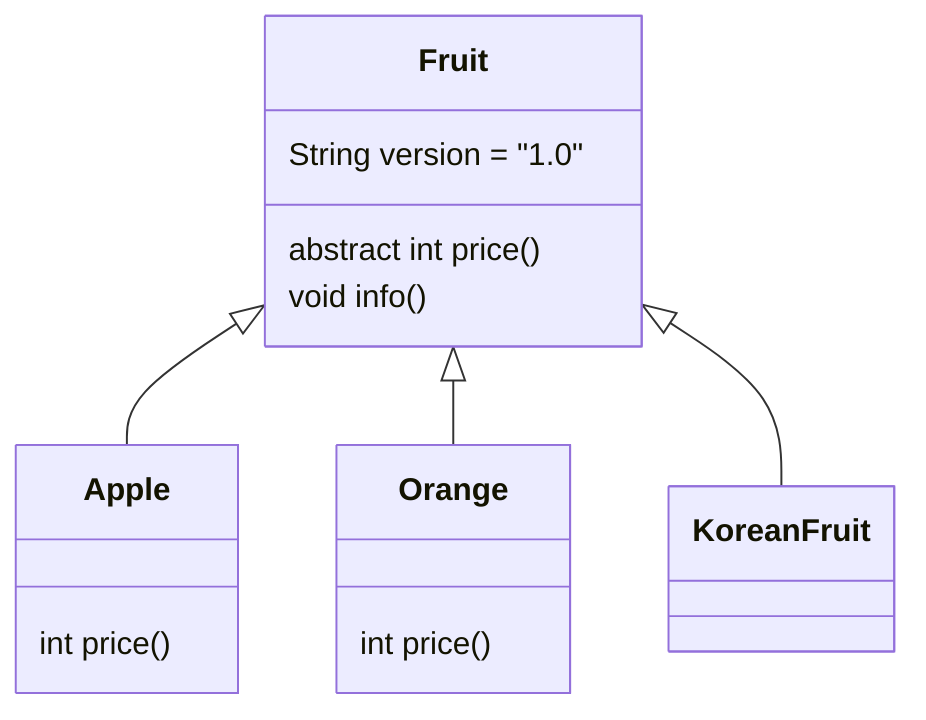

# Solution04

`src/Solution04.java`는 추상 클래스, 추상 메서드, 오버라이딩, 다형성 메서드 전달을 설명하는 예제다.

## 1. 한눈에 보기

| 항목 | 내용 |
|---|---|
| 부모 타입 | `Fruit` |
| 자식 타입 | `Apple`, `Orange` |
| 추상 타입 | `Fruit`, `KoreanFruit` |
| 핵심 개념 | 추상 클래스, 추상 메서드, 다형성, 필드 접근 |

## 2. 클래스 구조



## 3. 실행 흐름

```mermaid
flowchart TD
    A[Fruit f = new Apple()] --> B[f.price()]
    B --> C[Apple.price -> 1000]
    C --> D[f = new Orange()]
    D --> E[f.price()]
    E --> F[Orange.price -> 2000]
    F --> G[getPrice(new Apple())]
    G --> H[f.price() + f.version]
    H --> I[getPrice(new Orange())]
    I --> J[f.price() + f.version]
```

## 4. 초심자용 설명

### 추상 클래스

`Fruit`는 완성되지 않은 설계도다.
공통 필드와 일부 구현을 제공하면서, `price()`는 자식이 반드시 구현하게 만든다.

| 요소 | 의미 |
|---|---|
| `abstract class Fruit` | 직접 객체 생성 불가 |
| `abstract int price()` | 자식이 반드시 구현해야 함 |
| `void info()` | 공통 기능 제공 가능 |

### 추상 메서드

추상 메서드는 몸체가 없다.
즉, "이런 기능이 필요하다"만 선언한다.

### 오버라이딩

`Apple`과 `Orange`는 각각 `price()`를 다르게 구현한다.

| 클래스 | `price()` 결과 |
|---|---|
| `Apple` | `1000` |
| `Orange` | `2000` |

### 다형성 메서드 전달

```java
public static void getPrice(Fruit f)
```

부모 타입 매개변수에 자식 객체를 넘길 수 있다.
이 덕분에 `Apple`, `Orange`를 같은 코드로 처리할 수 있다.

### 필드와 메서드 차이

`getPrice()`에서 `f.price()`와 `f.version`을 함께 출력한다.

| 표현 | 특징 |
|---|---|
| `f.price()` | 실제 객체 기준으로 동작 |
| `f.version` | 참조 타입 기준으로 보이는 성격이 강함 |

## 5. 면접대비용 정리

### 자주 나오는 질문

| 질문 | 핵심 답변 |
|---|---|
| 추상 클래스란? | 공통 기능과 추상 메서드를 함께 가질 수 있는 미완성 클래스다. |
| 추상 메서드란? | 구현부 없이 선언만 한 메서드다. |
| 추상 클래스는 객체 생성이 가능한가? | 불가능하다. |
| 다형성이 왜 유용한가? | 부모 타입 하나로 여러 자식 객체를 처리할 수 있기 때문이다. |
| 필드와 메서드의 동작 차이는? | 메서드는 실제 객체 기준, 필드는 참조 타입 기준 성격이 강하다. |

### 핵심 포인트

| 포인트 | 설명 |
|---|---|
| 설계 역할 | 공통 규약을 강제한다 |
| 구현 역할 | 자식 클래스가 채운다 |
| 재사용성 | 공통 메서드는 부모에 둔다 |
| 확장성 | 새 자식 클래스를 쉽게 추가할 수 있다 |

## 6. 기억할 문장

> 추상 클래스는 공통 뼈대를 제공하고, 추상 메서드는 자식이 반드시 채워 넣게 만든다.

