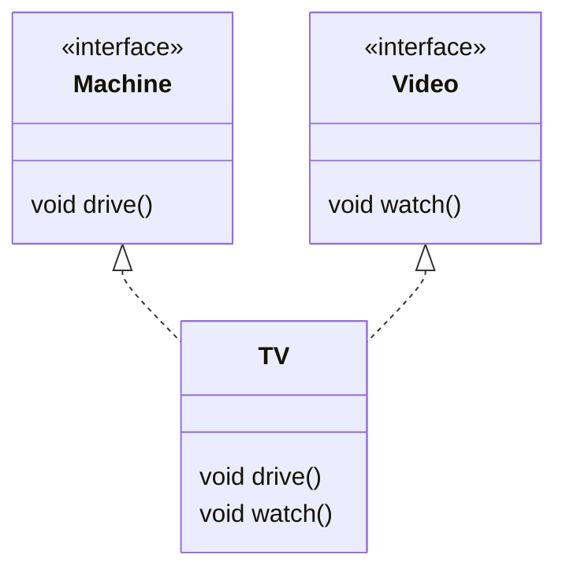

# Solution05

`src/Solution05.java`는 인터페이스, 다중 구현, 타입 분리, 인터페이스 기반 다형성을 보여주는 예제다.

## 1. 한눈에 보기

| 항목 | 내용 |
|---|---|
| 인터페이스 | `Machine`, `Video` |
| 구현 클래스 | `TV implements Machine, Video` |
| 핵심 개념 | 인터페이스, 다중 구현, 다형성, 타입 분리 |
| 핵심 메서드 | `drive()`, `watch()` |

## 2. 구조



## 3. 실행 흐름

```mermaid
flowchart TD
    A[TV tv = new TV()] --> B[Machine m = tv]
    B --> C[m.drive()]
    C --> D[TV.drive]
    D --> E[Video v = tv]
    E --> F[v.watch()]
    F --> G[TV.watch]
```

## 4. 초심자용 설명

### 인터페이스

인터페이스는 "무엇을 할 수 있는가"를 약속하는 규약이다.

| 특징 | 설명 |
|---|---|
| 메서드 선언 | 이 예제에서는 구현 없이 이름만 정의 |
| 역할 | 구현 강제, 역할 분리 |
| 객체 생성 | 인터페이스 자체는 직접 생성 불가 |

자바 인터페이스는 `default`, `static` 메서드를 가질 수도 있지만, 이 예제에서는 가장 기본 형태만 사용한다.

### 다중 구현

자바는 클래스 하나가 여러 인터페이스를 구현할 수 있다.

```java
class TV implements Machine, Video
```

이건 같은 클래스가 서로 다른 역할을 동시에 가진다는 뜻이다.

### 타입 분리

```java
Machine m = tv;
Video v = tv;
```

같은 객체라도 어떤 역할로 볼지에 따라 변수 타입을 다르게 쓸 수 있다.

| 변수 | 할 수 있는 일 |
|---|---|
| `Machine m` | `drive()` 사용 |
| `Video v` | `watch()` 사용 |

### 메서드 오버로드

```java
static void useMachine(Machine n)
static void useMachine(Video v)
```

매개변수 타입이 다르면 같은 이름의 메서드를 여러 개 만들 수 있다.

## 5. 면접대비용 정리

### 자주 나오는 질문

| 질문 | 핵심 답변 |
|---|---|
| 인터페이스란? | 구현해야 할 기능의 계약이다. |
| 클래스는 인터페이스를 몇 개까지 구현할 수 있나? | 여러 개 구현할 수 있다. |
| 인터페이스와 추상 클래스의 차이는? | 인터페이스는 역할 중심, 추상 클래스는 공통 상태와 구현 재사용에 더 가깝다. |
| 왜 `Machine m = tv`처럼 쓰나? | 필요한 기능만 노출해 결합도를 낮추기 위해서다. |
| 오버로드와 오버라이드의 차이는? | 오버로드는 매개변수 차이, 오버라이드는 상속받은 메서드 재정의다. |

### 핵심 포인트

| 포인트 | 설명 |
|---|---|
| 역할 분리 | 한 객체를 여러 관점으로 다룰 수 있음 |
| 결합도 감소 | 구현보다 인터페이스에 의존 |
| 다형성 | 같은 객체를 다양한 타입으로 참조 가능 |
| 확장성 | 새로운 구현을 쉽게 추가 가능 |

## 6. 기억할 문장

> 인터페이스는 "무엇을 할지"를 정하고, 구현 클래스는 "어떻게 할지"를 만든다.
